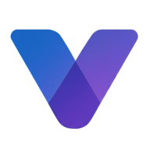

**🌎 Vickey Inspires Connection, Keeping Everyone Yours!**

<small>Vickey is a social platform built for freedom, creativity, and real connection — open source and here to stay.</small>

~~[Learn more](https://vickeyhub.com)~~ (Coming soon...)

---

<!---->

## Thanks

Thanks to [Misskey](https://misskey-hub.net) for laying the groundwork for this project.

Thanks to [Crowdin](https://crowdin.com/) for providing the localization platform that helps us translate Misskey and Vickey into many languages.

Thanks to [Docker](https://hub.docker.com/) for providing the container platform that helps us run Misskey and Vickey in production.

**Coming soon...**
